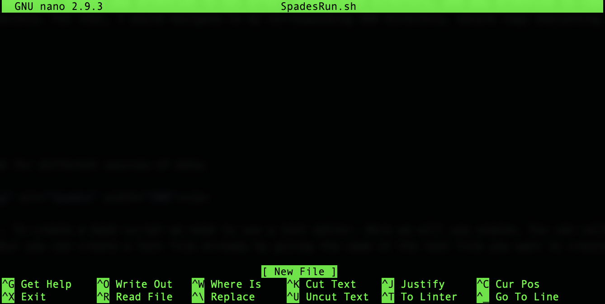
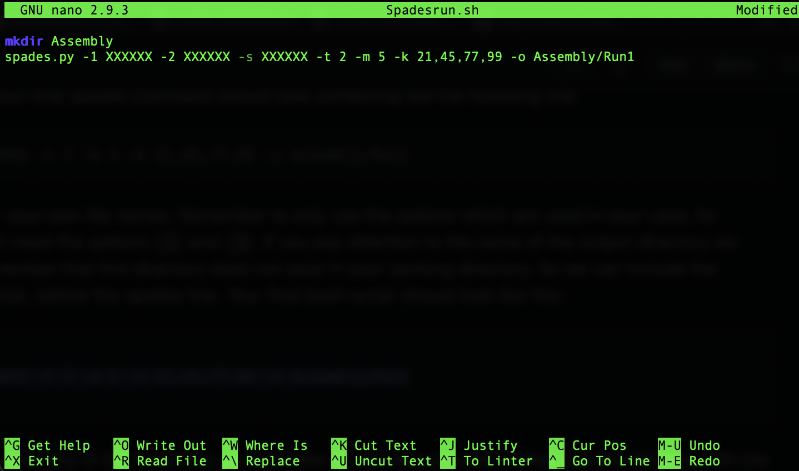
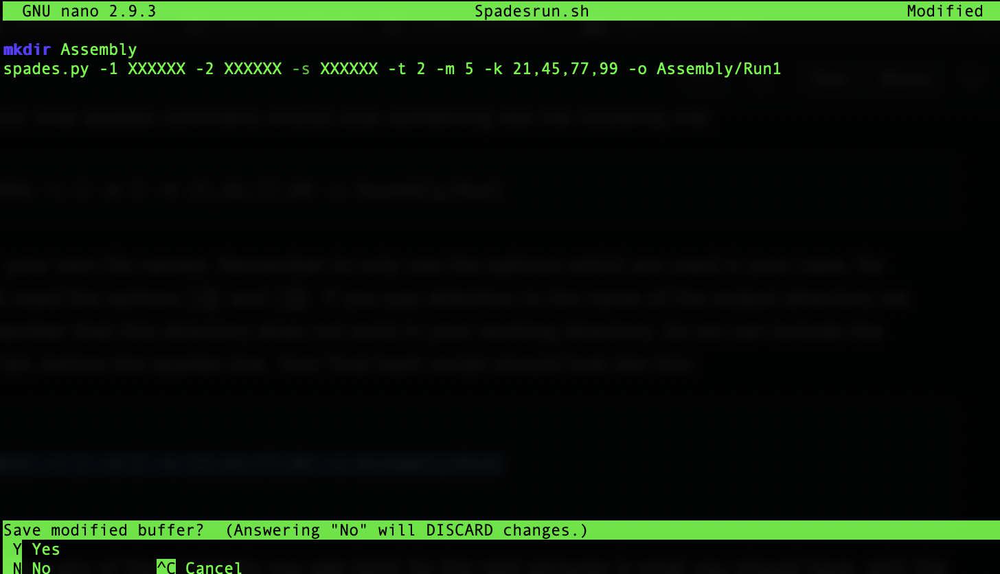
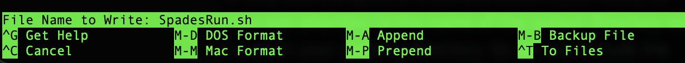

# **Genome Assembly**

From the first tutorial you have learned a lot of cool stuff about bash and handling files and directories, and running simple scripts and commands. Here we want you to get an idea of how to assemble a genome (or transcriptome) with a common genome assembler, [**Spades**](https://github.com/ablab/spades). Exceptionaly this time, we are not going to use the result of this step in following steps. This is a task to get used to run scripts and also to learn about a relatively simple way of assembling genomes.

## Getting the data

Each of you are assigned a unique SRA entry and will work on a different organisms for the following few exercises. Please find the SRA assigned to you in the following table:

| # | Name | Species | Family | Subfamily | SRA |
| - | --- | --- | --- | --- | --- |
| 1 | Karen | Liogma simplicicornis | Cylindrotomidae | Cylindrotominae | SRR3441821 |
| 2 | Rolando | Epiphragma mediale | Limoniidae | Limnophilinae | SRR13856859 |
| 3 | Steve | Rhipidia sejuga | Limoniidae | Limoniinae | SRR3452300 |
| 4 | Rohan | Pedicia vetusta | Pediciidae | Pediciinae | SRR3452301 |
| 5 | Mirela | Nephrotoma quadrifaria | Tipulidae | Tipulinae | SRR12518809 |
| 6 | Venkatesh | Nephrotoma suturalis | Tipulidae | Tipulinae | SRR8729871 |
| 7 | Homa | Nigrotipula nigra | Tipulidae | Tipulinae | SRR11470000 |
| 8 | Yared | Tipula aestiva | Tipulidae | Tipulinae | SRR17634812 |
| 9 | Hillary | Tipula fascipennis | Tipulidae | Tipulinae | SRR11469983 |
| 10 | Patito | Tipula flavolineata | Tipulidae | Tipulinae | SRR11469982 |
| 11 | Regina | Tipula maxima | Tipulidae | Tipulinae | SRR620757 |
| 12 | Monica | Trichocera saltator | Trichoceridae |  | SRR921653 |
| 13 | Noëlie | Trichoceridae sp. | Trichoceridae |  | SRR1738206 |

In the directory with your own name on the server, we have created another directory named `SRA` as you should know already. On the other hand, in the directory called `Hamid` you can find a directory with all the SRA files already downloaded (Hamid/DownloadedSRAs/). Please, copy only the SRA file corresponding to you directly in the SRA directory in your own directory. To do this you can use many commands but one option is to use the `scp` command. this command *secure copy* a file into a different location. Please pay attention to not affect anyone else directory, and pay attention to copy the content of your own directory into your own SRA directory. Fot that, I would navigate to my corresponding SRA directory, secure copy everything to my own SRA directory:

```
cd Users/Hamid/DownloadedSRAs/
scp -r SRAXXXXXXX ../../[My directory name]/SRA/

```

Remember that you could have downloaded these files from NCBI's database directly to your folder with a simple command. We scaped this step to avoid loosing some 30 minutes to a couple of hours based on the size of the file.

Now navigate into your SRA directory and list (ls command) what you have in there. You should see a directory with the name of your assigned SRA number. Change directory (cd) into it and list again to see what you have in it. You should now see one or two files named with your assigned SRA number plus `*.fastq.gz`. Do you recognize these extensions? You should now know what a `*.fastq` is, what about the `*.gz` format? As you know this is a compressed or zipped file. To continue with the rest of the practice you need to unzip this file. To do so we are going to use the `gunzip` command. In this case let me remind you what you have seen earlier! Make sure you are in the correct directory, you can check it by `pwd` command as you already learned. If you are not, `cd` into the directory with the zipped files. Then use the `gunzip` command as following:
```
gunzip *.gz
```
It should take few seconds... Now list to see what happened to your files. As you have seen this before, the `*` that we used here translates in the computer language as anything, so basically `*.gz` means anything finished with `.gz`.


-------------

## Assembling

**SPAdes:** This is a common assembler which is used for different sources of data. 

<p align="center"></p>

We are going to create a script to run this program. To create a bash script we need to use a text editor. Here we will use *nano*. You can call the program simply by typing `nano` followed by enter, but you can create a text file already by giving the name of the text file you want to create after the *nano* command. Something like this:

```
nano SpadesRun.sh
```

You should see something like this (Maybe your colours differ... details!):

<p align="center"></p>

Ok, so now let start creating our bash script. As you might have guessed from the name we used to create the file, a bash script is a text file which usually have a `.sh` extension. Now you write the commands you are going to use. Here things related to Spades run. First you call the program `spades.py` here. After that you have to especify the read files you want to assemble. If you have Paired End (PE) reads, you have to especify the read files with giving the name of the different files defined with the options `-1` and `-2`. And if you have a Single End (SE) file then you specify the name of your file after the option `-s`. For example:
```
-1 SRR11469918_1.fastq -2 SRR11469918_2.fastq
```
Or
```
-s SRR10859690.fastq
```
After this we need to specify the number of threads available for this analysis. This is especified with the option `-t`. As we are many trying to do the same thing and the number of CPUs are limited in our server lets give each run 2, so something like this: `-t 2` Now we need to tell the program how much memory we wanna give it, and again as we are many lets give the program only 5 gb of memory, like this: `-m 5` In a proper analysis and a big server you will typically use more CPU and memory, for example for one of my last runs I used 20 threads and 128 Gb of memory. The next important thing are the Kmer values. This is set by the option `-k` and can take various odd values, separated by a comma. Likt this for example: `-k 23,55,71,95` The last option we are going to use is an obligatory option used for defining the output directory: `-o Assembly/Run1` Your final spades command should look something like the following line:
```
spades.py -1 XXXXXX -2 XXXXXX -s XXXXXX -t 2 -m 5 -k 21,45,77,99 -o Assembly/Run1
```
Where in the place of XXXXXX you replace your own file names. Remember to only use the options which are used in your case, for example if you have a SE read file, you dont need the options `-1` and `-2`.
If you pay attention to the name of the output directory we have defined (`Assembly/`), you should remember that this directory does not exist in your working directory. So we can include the command to create this directoru in our script, before the spades line. Your final bash script should look like this:

```
mkdir Assembly
spades.py -1 XXXXXX -2 XXXXXX -s XXXXXX -t 2 -m 5 -k 21,45,77,99 -o Assembly/Run1

```

Remember that your final script should not have any of the XXXXXXs you see here! So the next pictures is what you should have, with the name of your SRA number:

<p align="center"></p>

Now we want to save it and exit the `nano` program. As you see in the bottom on the window, to exit you have to click on `x` while holding the control key. Then you will see this, look at the changing lines in the bottom:

<p align="center"></p>

It asks you if you wanna save of course! then click on `y`. Now you should see this at the bottom:

<p align="center"></p>

As you can see you can modify the name at this point if you want. But as we already set a name for the file you can just poress enter. and you are out on nano program. List to see what you have in the directory.

Now you need to run your script! To run a bash script you use the command `bash` followed by the name of the script and hit enter:
```
bash SpadesRun.sh
```
If you have no errors in the script, now the spades should be running... **Good Job!!!** If there are errors, read them! They help you resolve them...

Good job for the first day of workshop! Now you can kill the process by clicking on the letter `c` while holding the control key.

------------

If you have time and want to do more... Try to create an interactive bash script run Spades, but one which ask you for the names of the files to use, the number of CPU available, memory, kmers and the output folder... Here I place an example of an interactive script:

```
echo "What is your favourite food?"
read Food
echo "What is you name?"
read Name
echo "Hello my dear! you look great ;)"
echo "Can I invite you for a dinner dear $Name? I know a great place to eat $Food!"
```

Which you could copy in a bash script named for example `InteractiveBash.sh` and run it to understand how it works :)


