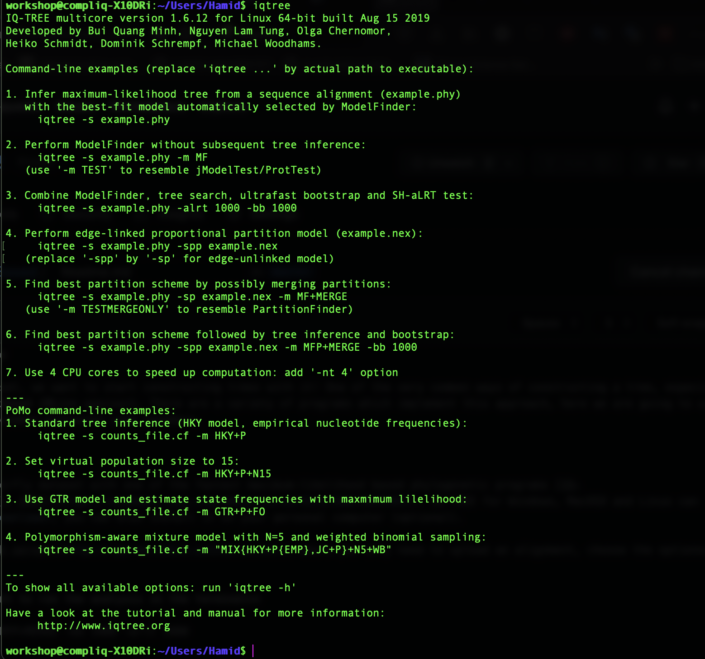

# Maximum-Likelihood Phylogenetic Inference

Now that we have seen how to create a dataset, we want to start constructing trees with it! One of the very common ways of constructing a tree, especially with genomics data, is the **Maximum Likelihood (ML)** approach. There are a variety of programs which implement this approach, here we are going to use **IQTree** which is again one of the most common softwares used nowadays.


## **IQTREE** 

In this tutorial, we will analyse our concatenated dataset with one of the fastest maximum-likelihood based phylogenetic programs [IQ-TREE](http://www.iqtree.org) ([Nguyen et al. 2015](https://academic.oup.com/mbe/article/32/1/268/2925592)). IQ-TREE for Windows, MacOSX and Linux can be downloaded [here](http://www.iqtree.org/#download), you can also install it on your personal computer if you want. The quickest is to try out the IQ-TREE [web server](http://iqtree.cibiv.univie.ac.at/), where you only need to upload an alignment, choose the options and start the analysis. This will be too easy! We are going to use the command line version of it!

Lets connect to the server and navigate to your own directory. Before anything, type `iqtree` and hit enter. You should see something like this:

<p align="center"></p>

Go through it and check few of the options it describes. I have uploaded the manual for the program in [Data](../../Data/). It is a great thing to always check the manual of the program. But I will describe the options we are interested in to use in different runs here.

First navigate to the directory `IQTreeAnalyses/Run1/` that you created in the last exercise. List the files you have here. You should just have your concatenated alignment dataset file in `*.phy` format. Now call the program but this time use the `-s` option followe by a space and the name of your alignment. It should be something like this:

```
iqtree -s [YOUR FILE NAME].phy
```
Here we have treated the whole alignment as a single "**Supergene**"! When this run finishes, go to `../Run2/` directory. Here you should have the partition information in addition to the phylip file. List to make sure you have both files. Now we will use also the partition file we created using the `-spp`option. 

```
iqtree -s file.phy -spp MyPartitions.txt
```
When you have finished both runs, lets wait for the everyone to reach the same point and we compare the trees together.

----------

Notes:

`iqtree` funtion will call the executable.

`-s` will call the alignment.

`-spp` is your patition file.

`-m` MFP+MERGE: will search for the best evolutionary model and partitionning scheme for your partitions.

`-bb` will perfom Ultrafast Boostrap.

`-arlt` will perform the SH-aLRT test.

```
iqtree -s file.phy -spp MyPartitions.txt -m MFP+MERGE -bb 1000 -alrt 1000
```

   Suffix	     Output File Explanation
   
   `.iqtree`	     Full result of the run, this is the main report file
   
   `.log`	       Run log
   
   `.treefile`	   Maximum likelihood tree in NEWICK format, can be visualized with treeviewer programs
   
   `.svg`	       Graphical tree representation in SVG format, done with ete view
   
   `.pdf`	       Graphical tree representation in PDF format, done with ete view
   
   `.contree`	   Consensus tree with assigned branch supports where branch lengths are optimized on the original alignment; printed if Ultrafast Bootstrap is selected
   
   `.ckp.gz`	    Checkpoint file; included if a job was stopped because of RAM/CPU limits.

